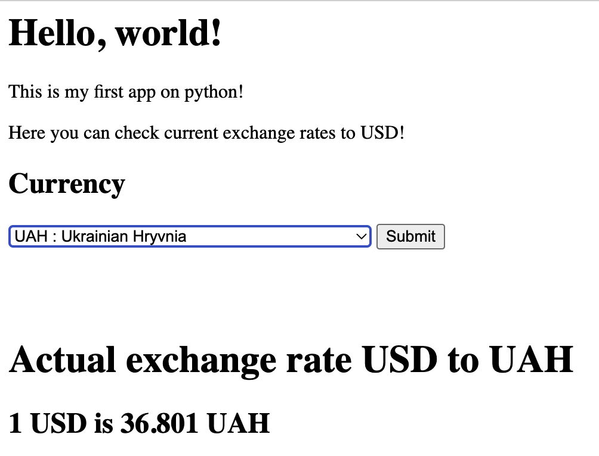
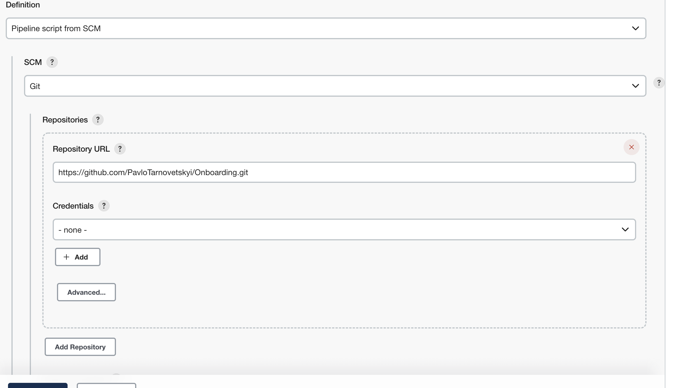
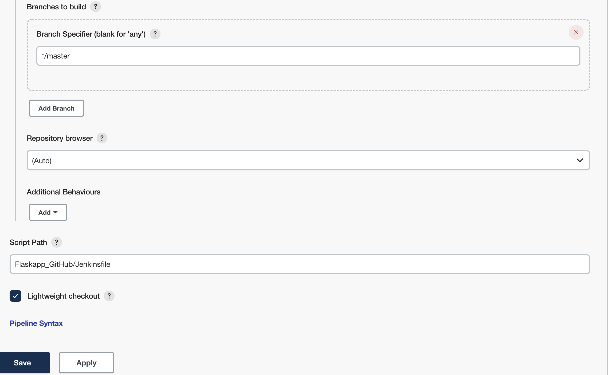
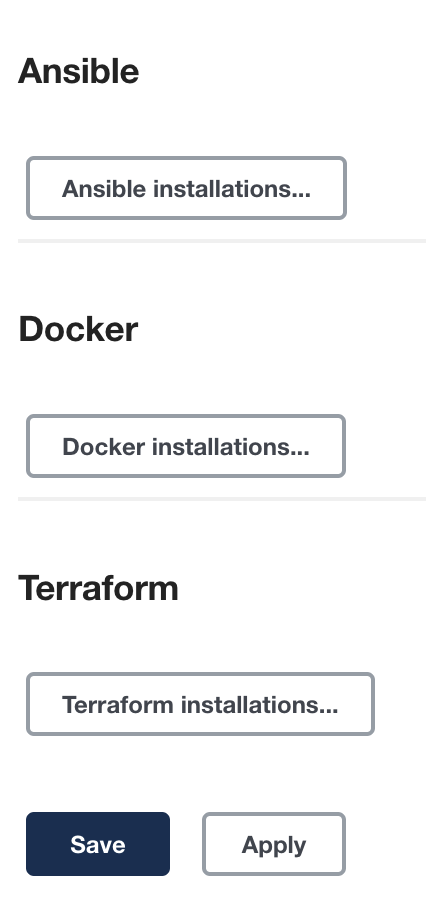

# Flaskapp "Exchange rates" 

## ___ *Hello, everyone! This is my first app on python! This app can help you check the actual currency exchange rate to USD!* ___

 ### You can run this app in your localhost, using your terminal, for that, you have to enter a folder with the app, then run the command "*python3 app.py*" and move to link http://127.0.0.1:5000 (of course you have to be set up python3 on your localhost) 

### If you want to deploy this app on the remote host, like an AWS EC2 instance, you can do it too.
### In this repo, you can find all the necessary files to deploy this app at the AWS EC2 instance.

## For deploying that app you have to use next tools:
- Jenkins 
- Docker
- Terraform
- Ansible
- AWS  

### For deploying that app on AWS EC2 you have to use your AWS account with your AWS user credentials that terraform will use to deploy infrastructure.

### Another important thing is to set up Jenkins with the necessary plugins and create a new job that will use a pipeline script from SCM, like in the picture below.

### In Jenkins Global Tool Configuration you have to set up Docker, Ansible and Terraform.

 ### There are 2 stages in Jenkinsfile that build and push docker image to dockerhub if you want to use the existing image do comment on those stages, other way change parameters according to your docker hub credentials (also change the name of the new docker image in script **ec2docker.sh**).